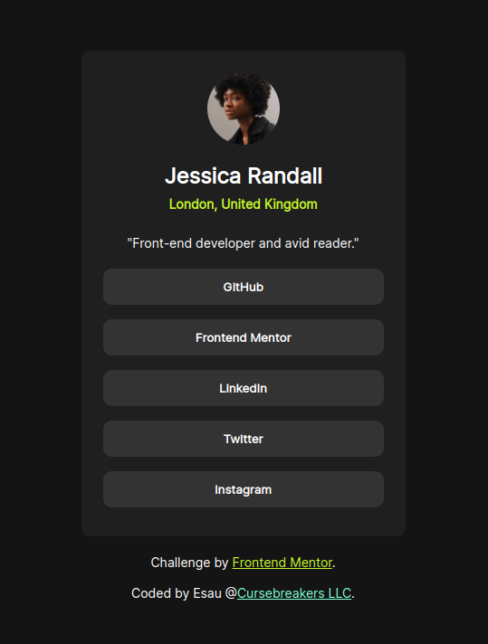

# Frontend Mentor - Social links profile solution

This is a solution to the [Social links profile challenge on Frontend Mentor](https://www.frontendmentor.io/challenges/social-links-profile-UG32l9m6dQ). Frontend Mentor challenges help you improve your coding skills by building realistic projects. 

## Table of contents

- [Overview](#overview)
  - [The challenge](#the-challenge)
  - [Screenshot](#screenshot)
  - [Links](#links)
- [My process](#my-process)
  - [Built with](#built-with)
  - [Useful resources](#useful-resources)
- [Author](#author)
- [Acknowledgments](#acknowledgments)

## Overview

### The challenge

Users should be able to:

- See hover and focus states for all interactive elements on the page

### Screenshot

### Links

- Solution URL: [On GitHub](https://github.com/cursebreakers/social-links) 
- Live Site URL: [On GitHub Pages](https://cursebreakers.github.io/social-links/)

## Process

### Built from

- Semantic HTML
- Custom CSS
- Flexbox
- Mobile-first workflow

### Tools

- [GitHub](https://github.com/)
- [VS Code](https://code.visualstudio.com/)

### Useful resources

- Most of the knowledge that I used, I learned from [The Odin Project](https://www.theodinproject.com/)- They offer amazing free courses in web development.

## Author

Esau Gavett

- Compnay [Cursebreakers LLC](https://cursebreakers.net/)
- Frontend Mentor - [@cursebreakers](https://www.frontendmentor.io/profile/cursebreakers)
- Website - [Meditations](https://www.your-site.com)

## Acknowledgments

Many thanks to Frontend Mentors for providing the challenege and materials.
